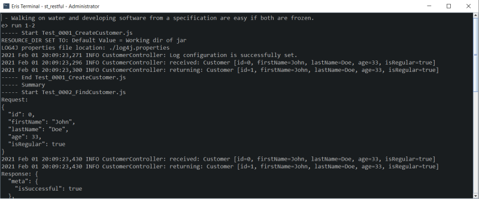

# Eris - System/Integration Testing Framework

This document will try to explained about this very simple and yet powerful testing framework. This framework is mainly aimed for writing integration test cases or system test cases for java services. It can be integrated for visual desktop solutions as swing or javafx, but in the first iteration it will not be included. The test cases can be written in JS or JUnit, and the framework focus on the regression and easy to maintain.   
 
The framework was written taken account some very simple principles and requirements: 
- Written in Java, small code footprint. Because every software/product is very different in many aspects, it is very important that the framework is should be easy to modify and that the code of apart from being open source is easy to understand.  
- Fast regression, easy to modify each test cases when the code of the software/product changes. Simple tools that help to "paint a picture" when the software/product code has been changed and the underlying regression fails.
- The test cases should be easy to understand, and mainly written by QA team and not only developments teams.
- Each test cases should test a specific task. Because the test cases are more integration/system test cases, when we monitor the output/footprint of a test case we are validating many functionalities at once. In contrast to making many Unit tests which are difficult to maintain, but also taking into account not to loose the coverage of the underlying software/product. This does not mean that for some scenarios one could complement with some unit testing, where the test cases cannot reach.

## Test case
The test cases can be written in JUnit or JS, this is a JS example:

	var module_customer_service = [
		"createCustomer:",
		"{",
		"  meta: {",
		"    isSuccessful: true",
		"  },",
		"  data: {",
		"    customers: [",
		"      {",
		"        id: 1,",
		"        firstName: 'John',",
		"        lastName: 'Doe',",
		"        age: 33,",
		"        isRegular: true",
		"      }",
		"    ]",
		"  }",
		"}",
	];
	
	
	function test() {	
		var service = b.createCustomerService();
		service.footPrint().createCustomer(b.withCustomer().firstName("John").lastName("Doe").age(33).regular(true).build());
	} 

The test cases are divided in two parts a section of modules and a testing part. The modules section is a list of modules that the test case is monitoring. It is the so called expected output/footprint. Each test cases when executed will generated a footprint, this output is what we monitor. Instead of using assert statements which are difficult to maintain.

When constructing the testing environment one should decides what to monitor what not, one simple rule would be any interaction with external software/api you want to monitor. For example if your software interacts with a third party authorization, you want to monitor that interaction.

List of some examples of modules to monitor:
- Third party interactions
- Persistent data (database, file output, )
- Service output (lets say your service is customer lookup service, when you invoke customer lookup, you want to monitor what the result of that query).
- Device interaction, (lets say your product print to printer, you want to monitor that output).

Each module has a name, and each module should begin with the keyword "module"

	var module_<module name> = [
	
Each module will be declared in the module.json, where you specify the footprint file to monitor and you can also specify exception rules written with regular expression.

In the other section we have the actual test case we are executing. In this example we create a service (customer service), and then create a customer with this service. The service that we are testing generates a footprint, this footprint is persisted in a specific file, and the test cases monitors that file for changes, and compares it with the expected value each time the test case is executed.

## Terminal
The terminal program is a tool that one can easy run test cases, modify them and insert new expected output. To run the terminal execute terminal.bat

Some commands in the terminal:

	run 2
	//runs the test case 2
	insert 2
	//insert the recently executed test case with the actual generated output.
	diff 2
	//displays all the differences from the expected output in the test cases from the actual output the test case
	np 2
	//opens a test cases with notepad++ for edit

The different commands can also be access using the batch file e.bat. for instance to run test case 3, just type in a console:

	c:\e.bat run 3
	
	
### Usage

Complete command list:

	list <Testcase pattern>
	find <pattern>
	np <Filename> | <Testcase>
	insert [<test case list>] [<include module list>]
	diff [<test case list>] [<include module list>]
	diffw <test case> [<include module list>]
	cmd: [<directory>]
	cmd32 [<directory>]
	run [<test case list>] [<include module list>] [&|-bg]
	junit
	copy <Test case>
	cls
	actual <test case> <module name>
	exit
	restart
	ls
	ll
	cat
	tail
	touch

## Test case template
The format and syntax of each test cases (part from the expected module list), should be defined by the development team. Once the development teams writes the different helpers methods and specify what should be tested or not, the QA team can copy the different test cases and generate more.

For that the framework provides 3 type of builders/runtime objects. The type of objects have different scopes, and the scopes are as follows:
- ENGINE SCOPE
- SUIT SCOPE 
- TEST CASE SCOPE

This means that each builder/runtime object will be created taking account the scope. For instance if you run a test case, the objects that are TEST CASE SCOPE will be created each time a test cases is executed. While the ENGINE SCOPE will only be created once (when the terminal is launched). And the last SUIT SCOPE is created at the beginning of the executions. (if you run 5 test cases the SUIT SCOPE will be created once and the TEST CASE SCOPE will be created 5 times).

In addition every builder/runtime object has a name and a destroy method. The name is used to reference it in the test case, and the destroy method is to destroy resources if necessary (close a file for example).

In the above test case example we have on builder "b".

		var service = b.createCustomerService();

And this builder "b" is "TEST CASE SCOPE" object, which means that it is created each time a test case is executed. Also the purpose of this object is to act as an builder, to facilitates the work of the QA team when writing test cases. In this example instead of creating a JSON object concatenating string we can easily use the builder pattern:

	b.withCustomer().firstName("John").lastName("Doe").age(33).regular(true).build() 

It is not mandatory to write the integration code for the Eris engine, but it is recommended. If not it can be difficult to intercept the test case lifetime cycle. In similar way one in JUnit uses @BeforeEach/@AfterEach/@BeforeAll/@AfterAll, in the Eris engine we have the builders life cycle and scope to manage the test case life cycle and resources.

## Engine Integration

As mentioned earlier to integrate with the Eris engine, we have to implement this interface:

	public interface IErisFactory {
		List<IBuilder> createBuilders(Scope scope);	
		
		List<ICommand> createExternalCommands();
	}

In <URL> we have some projects with some examples of how to write the integration and structure of the test suit.

## External Commmands

This interface is useful for adding new commands to the terminal. For that implement the following:
	
	public interface ICommand {
		String description();
		String name();
		void exec(ICommandConsole console, List<String> options);
		String usage();		
	}

## Engine/Terminal Configuration:

The framework configuration is written in yaml and located in the file eris.yaml:
	
	notepad: "notepad++"
	diffw: "C:\\Program Files (x86)\\WinMerge\\WinMergeU.exe"
	factory: st_restful.ErisFactory
	testCaseDirectory: ../src/main/test-case 
	
	
## Testing strategies and simulators

### Example 1

Because the framework rely on the footprint generated it is important to interface your software at certain points, and in some cases one need to write simulators to simulate the behavior of an external application. Where to interface can vary substantial. Lets take a PostreSQL, as an example. Lets say we have a service that uses SQL to insert into a PostgreSQL data base. We could just launch locally a data base service and after executed our service we could ask the database what changed and we could output this footprint to our test cases. But because this means every one who uses the test suit would need to have the PostgreSQL running before running a test case, and we would need to clean up every time we launch the test cases. And this external dependency is not very helpful. One very simple solution would be to change the database with a more simile memory database (for instance HSQLDB). In this way we give robustness to our test suit, but on the other hand we do not have the exact same production environment. This design desition have to be taking into account when creating the testing environment. My suggestions is always prioritize robustness and maintainability over "correctness"

In the examples provided there is and test case with HSQLDB, the test cases is as follows:

	var module_database = [
		"MY_TABLE:",
		"	ID=1",
		"	XML=test",
	];
	
	function test() {	
		var service = s.createDatabaseService();
		service.insert(1, "test");	
	}

In this example we have a service that generates a record in a SQL database, and we monitor every time a record is inserted to the database. If one need to insert records to the database before a test case is executed we would solve it in the builders, or we could just prepare the database, in the test case just before creating the service. The generation of the module footprint is done in the TEST CASE SCOPE builder "s".

	public class DatabaseBuilder implements IBuilder {
		...
		@Override
		public void destroy() {
			if (scope == Scope.TEST_CASE) {
				for (String table : tableOrderBy.keySet()) {
					log.write(tablesToFootprint(table));				
				}
			}		
		}	
	}

### Example 2
	
Another interesting example would be, lets say we need to authorize a credit card with a third party service. Because the third party api probably might not have an public testing end point, we might be forced to interface in some point in our code and write our simulator that simulates the response that the third party service should respond.  

Example, one would need to write an interface and two implementations:	
- IClient.java
- Client.java
- Simulator.java

The test cases that one would write will only cover (test) the simulator.java, thats why it is important that the client.java code should be as simple as possible and not contain business logic, only communication code. And we would only monitor with the different test cases the data that is sent to the simulators, a test case could be something like this:

	var Simulator = Java.type('third_party_authorization.Simulator');
	
	var module_third_party_authorization = [
		"authorize:",
		"<root>",
		"<date>210127 213307</date>",
		"<amount>10000</amount>",
		"</root>",
	];
	
	var module_my_service = [
		"someBusinessRules{",
		"  approved: true",
		"}",
	];
		
	function test() {
		Simulator.put("authorize", "MESSAGE_APPROVED");	
		var service = s.createService();
		service.someBusinessRules(10000);	
		
	}

In this test case we are monitoring the output of what our service is generated (with the module module_my_service) when we invoke someBusinessRules, and secondly we are monitoring each interaction with the simulator and the data that is sent to it which is in this case XML content(module_third_party_authorization).

The interface could be:

	public interface IClient {
		String authorize(String xml);
	}

And the simulator could be something like this:

	@Override
	public String authorize(String xml) {
		log.write("authorize:\r\n", xml);
		return pop("authorize");
	}

In this example the simulators uses a very simple static memory simulator, we specify in the test case what the response should be before we execute "someBusinessRules", because we know before hand what we need to have in response. 	
		
		//prepare simulator response
		Simulator.put("authorize", "MESSAGE_APPROVED");	

This complete example can be found here: <URL>

## Modules/Footprint

As one can see the center of the framework is the modules and the footprint that the software/product generates. To generate a footprint, one can just write to a file, or use the class Footprint 

	private Footprint log = new Footprint("third_party_authorization");
	...	
	log.write("authorize:\r\n", xml);
	

It is important that before you add the expected output into the test case, that you declare the module in the modules.json file:

	[
	  {
	    "path": "logs/third_party_authorization.footprint",
	    "name": "third_party_authorization",
	    "patterns": [
	        "\\<date\\>(.*)\\<\\/date\\>"
	   ]
	  }	
	]

You have to specify the name and the file that should be monitored. The pattern list is a list of regular expression so that you can escape some content that you are not interested to monitor or just cannot. For instance a date.

## Jenkins integrations

With the command junit, we can generate a JUnit test case from the JS test case, in this way we can later on integrate all test cases to run in a jenkins server so that we can make daily nightly regression. This is very useful when the amount of test cases start to increase to the hundreds, and you need to monitorthe different test suits.

## After notes

This framework has been completely rewritten and has been inspired by other similar framework that I have been doing the last couple of years, and this is the output of many discussions I have had with Sebastian Fontana on how to implement an simple, clean and maintainable testing environment. The main purpose is that the framework should be simple and easy to extend, in case one need to change it to your porduct needs. Because it has been rewritten it might contains some bugs, just report them and I'll fix them a soon as possible, also and suggestion would be gladly appreciated.

 
	